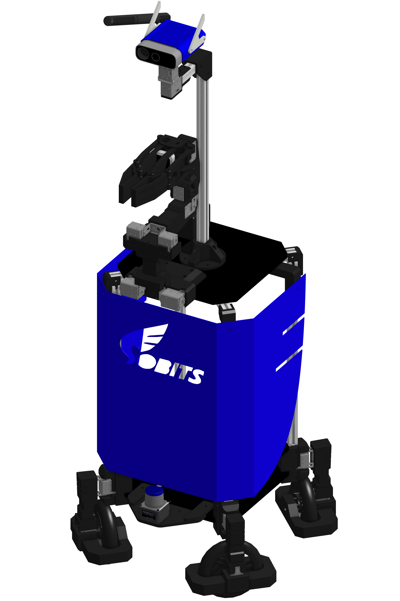
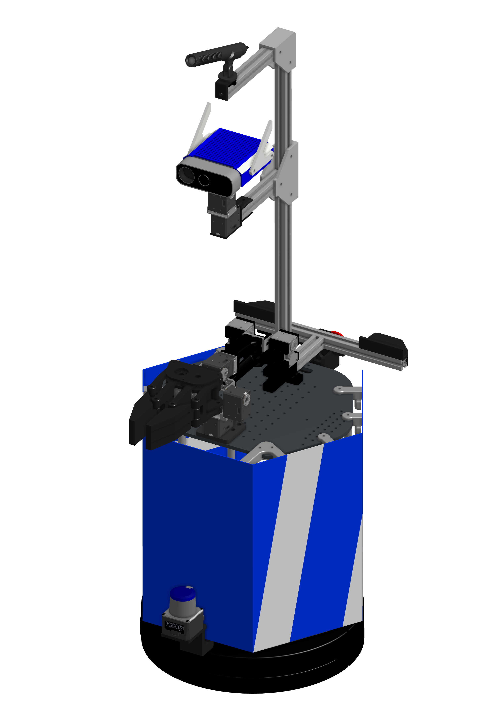
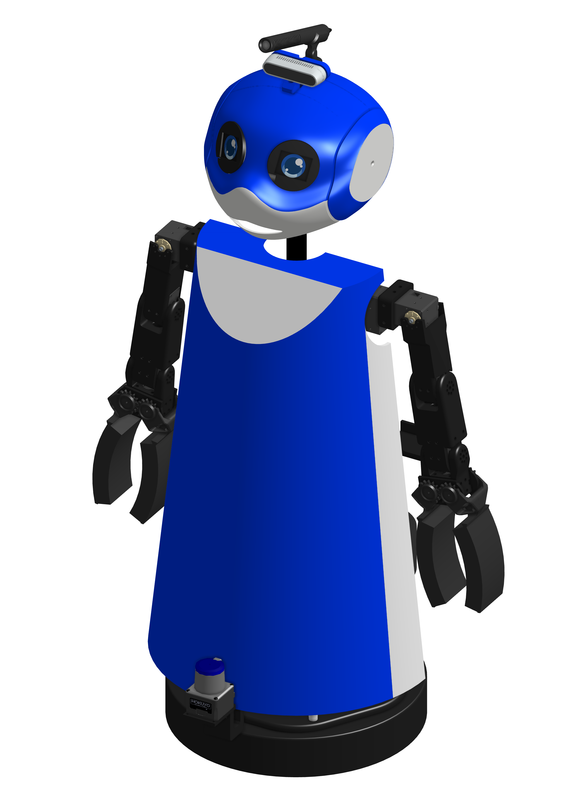

<a name="readme-top"></a>

[JA](README.md) | [EN](README.en.md)

[![Contributors][contributors-shield]][contributors-url]
[![Forks][forks-shield]][forks-url]
[![Stargazers][stars-shield]][stars-url]
[![Issues][issues-shield]][issues-url]
[![License][license-shield]][license-url]

# SOBITS Common

<!-- 目次 -->
<details>
  <summary>目次</summary>
  <ol>
    <li>
      <a href="#概要">概要</a>
    </li>
    <li>
      <a href="#環境構築">環境構築</a>
      <ul>
        <li><a href="#環境条件">環境条件</a></li>
        <li><a href="#インストール方法">インストール方法</a></li>
      </ul>
    </li>
    <li><a href="#実行操作方法">実行・操作方法</a></li>
    <li><a href="#マイルストーン">マイルストーン</a></li>
    <!-- <li><a href="#contributing">Contributing</a></li> -->
    <!-- <li><a href="#license">License</a></li> -->
    <li><a href="#参考文献">参考文献</a></li>
  </ol>
</details>


<!-- レポジトリの概要 -->
## 概要

SOBITS Commonのレポジトリでは、SOBITSがこれまで開発してきた実機ロボットを動かすため，共通のライブラリです．ロボットに搭載されているアクチュエータやセンサーなど共通で使用するリソースを統一し，ライブラリ化となったものです．

SOBITS Commonが必要とされるSOBITSのロボットはこちらになります．

| SOBIT PRO | SOBIT EDU | SOBIT MINI |
| :---: | :---: | :---: |
|  |  |  | 
| [Gitへ移動](https://github.com/TeamSOBITS/sobit_pro) | [Gitへ移動](https://github.com/TeamSOBITS/sobit_edu) | [Gitへ移動](https://github.com/TeamSOBITS/sobit_mini) |

<p align="right">(<a href="#readme-top">上に戻る</a>)</p>


<!-- セットアップ -->
## セットアップ

ここで，本レポジトリのセットアップ方法について説明します．

<p align="right">(<a href="#readme-top">上に戻る</a>)</p>

### 環境条件

正常動作のため，以下の必要な環境を整えてください．

| System  | Version |
| ------------- | ------------- |
| Ubuntu | 20.04 (Focal Fossa) |
| ROS | Noetic Ninjemys |

> [!NOTE]
> `Ubuntu`や`ROS`のインストール方法に関しては，[SOBITS Manual](https://github.com/TeamSOBITS/sobits_manual#%E9%96%8B%E7%99%BA%E7%92%B0%E5%A2%83%E3%81%AB%E3%81%A4%E3%81%84%E3%81%A6)に参照してください．

<p align="right">(<a href="#readme-top">上に戻る</a>)</p>


### インストール方法

1. ROSの`src`フォルダに移動します．
   ```sh
   $ roscd
   # roscdは設定によって"cd ~/catkin_ws/"のコマンドと同様
   $ cd src/
   ```
2. 本レポジトリをcloneします．
   ```sh
   $ git clone https://github.com/TeamSOBITS/sobits_common
   ```
3. レポジトリの中へ移動します．
   ```sh
   $ cd sobits_common/
   ```
4. 依存パッケージをインストールします．
   ```sh
   $ bash install.sh
   ```
5. パッケージをコンパイルします．
   ```sh
   $ roscd
   $ catkin_make
   ```

<p align="right">(<a href="#readme-top">上に戻る</a>)</p>


<!-- 実行・操作方法 -->
## 実行・操作方法
本レポジトリは共通ライブラリのため，実行すべきプログラムがありません．

<p align="right">(<a href="#readme-top">上に戻る</a>)</p>


<!-- マイルストーン -->
## マイルストーン

- [x] OSS
    - [x] PCL関係のライブラリをYOLOレポジトリへ移行
    - [x] HSRの依存パッケージの分離
    - [x] ドキュメンテーションの充実 
    - [ ] カスタムmsgの更新

現時点のbugや新規機能の依頼を確認するために[Issueページ][issues-url] をご覧ください．

<p align="right">(<a href="#readme-top">上に戻る</a>)</p>


<!-- CONTRIBUTING -->
<!-- ## Contributing

Contributions are what make the open source community such an amazing place to learn, inspire, and create. Any contributions you make are **greatly appreciated**.

If you have a suggestion that would make this better, please fork the repo and create a pull request. You can also simply open an issue with the tag "enhancement".
Don't forget to give the project a star! Thanks again!

1. Fork the Project
2. Create your Feature Branch (`git checkout -b feature/AmazingFeature`)
3. Commit your Changes (`git commit -m 'Add some AmazingFeature'`)
4. Push to the Branch (`git push origin feature/AmazingFeature`)
5. Open a Pull Request

<p align="right">(<a href="#readme-top">上に戻る</a>)</p> -->


<!-- LICENSE -->
<!-- ## License

Distributed under the MIT License. See `LICENSE.txt` for more information.

<p align="right">(<a href="#readme-top">上に戻る</a>)</p> -->


<!-- 参考文献 -->
## 参考文献

* [Dynamixel SDK e-Manual](https://emanual.robotis.com/docs/en/software/dynamixel/dynamixel_sdk/overview/)
* [ROS Control](http://wiki.ros.org/ros_control)

<p align="right">(<a href="#readme-top">上に戻る</a>)</p>


<!-- MARKDOWN LINKS & IMAGES -->
<!-- https://www.markdownguide.org/basic-syntax/#reference-style-links -->
[contributors-shield]: https://img.shields.io/github/contributors/TeamSOBITS/sobit_common.svg?style=for-the-badge
[contributors-url]: https://github.com/TeamSOBITS/sobit_common/graphs/contributors
[forks-shield]: https://img.shields.io/github/forks/TeamSOBITS/sobit_common.svg?style=for-the-badge
[forks-url]: https://github.com/TeamSOBITS/sobit_common/network/members
[stars-shield]: https://img.shields.io/github/stars/TeamSOBITS/sobit_common.svg?style=for-the-badge
[stars-url]: https://github.com/TeamSOBITS/sobit_common/stargazers
[issues-shield]: https://img.shields.io/github/issues/TeamSOBITS/sobit_common.svg?style=for-the-badge
[issues-url]: https://github.com/TeamSOBITS/sobit_common/issues
[license-shield]: https://img.shields.io/github/license/TeamSOBITS/sobit_common.svg?style=for-the-badge
[license-url]: LICENSE
